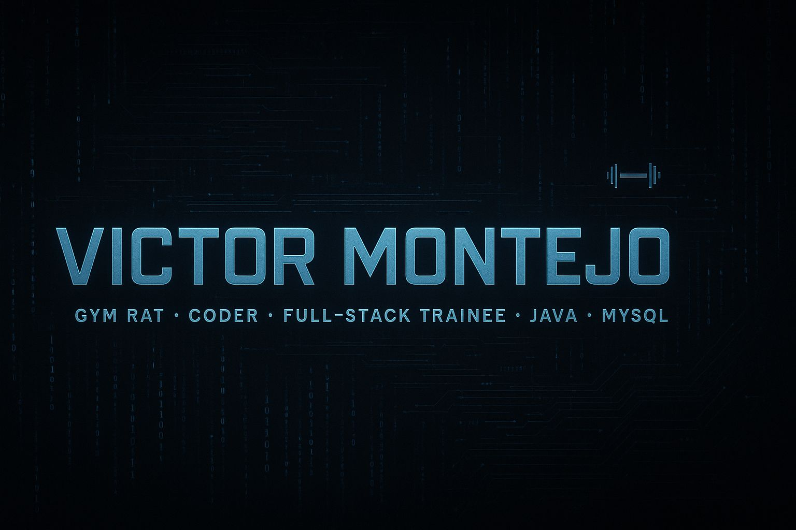

 
<h1 align="center"> ¡Hi!  I'm Victor Montejo</h1>

 

  
  
  
  
  
 
  

<table align="center">
<tr border="none">
<td width="50%" align="left">

- 🎓 Soy estudiante de Análisis de Sistemas.
- 🧪 Amante de la tecnología, el desarrollo y los desafíos.
- 💪 Fanático del gym y del progreso constante.
- 🚀 Creciendo como developer.
- 📍  Buenos Aires, Argentina.
- 📧 montejovictor779@gmail.com

</td>
<td width="50%" align="center">
  
</td>
</tr>
</table>
<h2>💻 Languages and Tools:</h2>

  <code></code>
  <code></code>
  <code></code>
  <code></code>
  <code></code>
  <code></code>
  <code></code>
  <code></code>
  <code></code>
 

<table>
  <tr>
    <td style="font-weight: bold; padding-right: 10px; vertical-align: center; border: none;">Backend:</td>
    <td></td>
  </tr>
  <tr>
    <td style="font-weight: bold; padding-right: 10px; vertical-align: center; border: none;">Frontend:</td>
    <td></td>
  </tr>
  <tr>
    <td style="font-weight: bold; padding-right: 10px; vertical-align: center; border: none;">Database:</td>
    <td></td>
  </tr>
  <tr>
    <td style="font-weight: bold; padding-right: 10px; vertical-align: center; border: none;">Version Control:</td>
    <td></td>
  </tr>
  <tr>
    <td style="font-weight: bold; padding-right: 10px; vertical-align: center; border: none;">IDEs:</td>
    <td></td>
  </tr>
  <tr>
    <td style="font-weight: bold; padding-right: 10px; vertical-align: center; border: none;">Operating Systems:</td>
    <td></td>
  </tr>
</table>

 <h2> 📊 Github Stats ....</h2>

	

    <picture align="center">
      <source media="(prefers-color-scheme: dark)" srcset="https://raw.githubusercontent.com/ashu-guo/ashu-guo/master/assets/github-contribution-grid-snake.svg">
      <source media="(prefers-color-scheme: light)" srcset="https://raw.githubusercontent.com/ashu-guo/ashu-guo/master/assets/github-contribution-grid-snake.svg">
      
    </picture>

<h2> Connect with me 🚀</h2>

 
  
    
     

